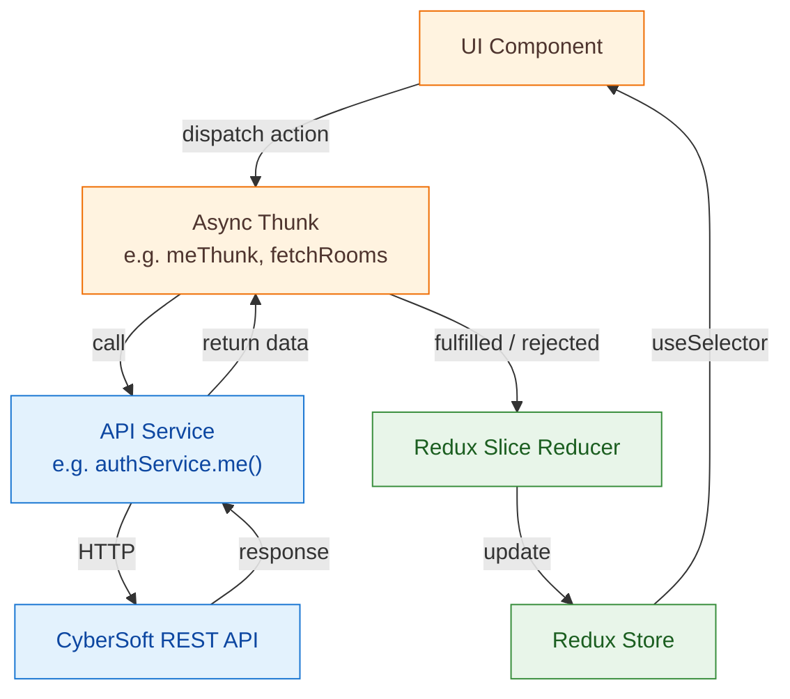
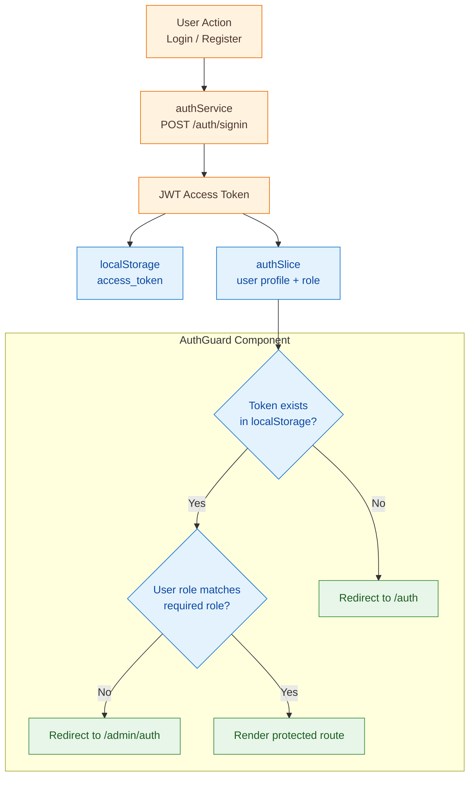

# AirBnB — Full-Stack Accommodation Booking Platform

A **production-grade, full-stack Airbnb clone** built with React 19, TypeScript, Redux Toolkit, and Tailwind CSS v4. The platform delivers a pixel-perfect accommodation browsing experience with real-time booking, user authentication, and a complete admin management dashboard.

## 🏠 Project Overview

This project is a full-featured Airbnb-inspired web application that connects travelers with unique accommodations around the world. Users can browse listings by location, view detailed room information with image galleries, submit reviews, and manage bookings — all through a modern, responsive UI. An admin panel provides full CRUD management of users, rooms, locations, and bookings.

---

## 🎬 Live Demo

> **Production deployment:** Hosted on [Vercel](https://vercel.com) with SPA rewrite rules for client-side routing.

---

## 📚 Table of Contents

1. [🏠 Project Overview](#-project-overview)
2. [🎬 Live Demo](#-live-demo)
3. [✨ Features](#-features)
4. [🏗️ Architecture](#-architecture)
   - [Application Flow](#application-flow)
   - [State Management Flow](#state-management-flow)
5. [🛠️ Tech Stack](#-tech-stack)
6. [📁 Project Structure](#-project-structure)
7. [⚡ Getting Started](#-getting-started)
   - [Prerequisites](#prerequisites)
   - [Installation](#installation)
   - [Environment Variables](#environment-variables)
   - [Development](#development)
   - [Production Build](#production-build)
8. [📖 Code Documentation Standards](#-code-documentation-standards)
9. [🧩 Component Library](#-component-library)
10. [🔐 Authentication & Authorization](#-authentication--authorization)
11. [📝 API Services](#-api-services)
12. [🚀 Deployment](#-deployment)
13. [📄 License](#-license)

---

## ✨ Features

### 🧳 Customer-Facing (Home Template)

| Feature | Description |
| --- | --- |
| **Home Page** | Hero search bar, location-based browsing, and featured listings grid. |
| **Listing Page** | Filterable accommodation listings with card previews, pagination, and location search. |
| **Room Detail** | Full room info with image gallery, amenity list, host details, reviews, rating stars, and booking widget. |
| **Authentication** | Sign-up / sign-in forms with validation (React Hook Form + Yup), JWT token management, and persistent sessions. |
| **My Bookings** | View, track, and manage all personal reservations. |
| **User Profile** | Edit personal information and account settings. |

### 🔧 Admin Dashboard

| Feature | Description |
| --- | --- |
| **Dashboard Overview** | Admin analytics and at-a-glance metrics. |
| **User Management** | Full CRUD operations on user accounts with role-based access control. |
| **Room Management** | Create, edit, and delete room listings with image uploads. |
| **Location Management** | Manage destination locations with images, provinces, and country metadata. |
| **Booking Management** | View all bookings, filter by status, and manage reservation lifecycles. |

### 🎨 UX & Performance

| Capability | Implementation |
| --- | --- |
| **Lazy Loading** | All pages and templates use `React.lazy()` + `Suspense` for code-split bundles. |
| **Optimized Chunks** | Vite manual chunks separate vendor, home, and admin bundles for parallel loading. |
| **Global Loading** | Redux-driven loading overlay for async operations. |
| **Responsive Design** | Tailwind CSS v4 utility-first responsive layout across all breakpoints. |
| **Route Guards** | `AuthGuard` component protects private routes with role-based redirection. |

---

## 🏗️ Architecture

### Application Flow

```mermaid
flowchart LR
  subgraph Client["React SPA"]
    direction TB
    Router["React Router v7\nBrowser Router"]
    Templates["HomeTemplate / AdminTemplate"]
    Pages["Lazy-Loaded Pages"]
    Components["Reusable Components"]

    Router --> Templates --> Pages --> Components
  end

  subgraph State["State Management"]
    direction TB
    Store["Redux Toolkit Store"]
    Slices["authSlice / bookingSlice\nroomSlice / locationSlice\nloadingSlice"]
    Hooks["useAppDispatch\nuseAppSelector"]

    Store --> Slices
    Hooks --> Store
  end

  subgraph API["API Layer"]
    direction TB
    Axios["Axios Instance\nBase URL + Token Interceptor"]
    Services["authService / roomService\nbookingService / locationService\ncommentService / userService"]

    Services --> Axios
  end

  subgraph Backend["External Backend"]
    CyberSoft["CyberSoft AirBnB API\nREST Endpoints"]
  end

  Components --> Hooks
  Pages --> Services
  Slices -->|async thunks| Services
  Axios -->|HTTP requests| CyberSoft
  CyberSoft -->|JSON responses| Axios

  classDef client fill:#e3f2fd,stroke:#1976d2,color:#0d47a1;
  classDef state fill:#f3e5f5,stroke:#7b1fa2,color:#4a148c;
  classDef api fill:#fff3e0,stroke:#ef6c00,color:#4e342e;
  classDef backend fill:#e8f5e9,stroke:#388e3c,color:#1b5e20;

  class Router,Templates,Pages,Components client;
  class Store,Slices,Hooks state;
  class Axios,Services api;
  class CyberSoft backend;
```



### State Management Flow



---

## 🛠️ Tech Stack

| Layer | Technology | Purpose |
| --- | --- | --- |
| **UI Framework** | React 19 | Component-based UI with Hooks and React Compiler |
| **Language** | TypeScript 5.9 | Static typing and developer experience |
| **Build Tool** | Vite 7 | Lightning-fast HMR, optimized production builds |
| **Styling** | Tailwind CSS v4 | Utility-first CSS framework |
| **Routing** | React Router v7 | Declarative client-side routing with lazy loading |
| **State Management** | Redux Toolkit | Centralized state with slices and async thunks |
| **Forms** | React Hook Form + Yup | Performant form handling with schema validation |
| **HTTP Client** | Axios | Promise-based API communication with interceptors |
| **Icons** | Lucide React | Modern, customizable icon library |
| **Linting** | ESLint 9 + TypeScript ESLint | Code quality and consistency |
| **Deployment** | Vercel | Serverless SPA hosting with SPA rewrites |

---

## 📁 Project Structure

```txt
airbnb2/
├── public/                            # Static assets served at root
├── src/
│   ├── assets/                        # Images, fonts, and static resources
│   ├── components/
│   │   ├── common/                    # Reusable UI primitives
│   │   │   ├── Badge.tsx              #   Status and tag badges
│   │   │   ├── Button.tsx             #   Primary/secondary action buttons
│   │   │   ├── Card.tsx               #   Content card containers
│   │   │   ├── EmptyState.tsx         #   Empty data placeholder
│   │   │   ├── ImageGallery.tsx       #   Multi-image viewer with lightbox
│   │   │   ├── Input.tsx              #   Form input with validation states
│   │   │   ├── Modal.tsx              #   Overlay dialog component
│   │   │   ├── Pagination.tsx         #   Page navigation controls
│   │   │   ├── RatingStars.tsx        #   Star rating display
│   │   │   ├── SearchBar.tsx          #   Location/date/guest search widget
│   │   │   ├── Select.tsx             #   Dropdown select input
│   │   │   └── Table.tsx              #   Data table with sorting
│   │   ├── errors/                    # Error boundary and fallback UIs
│   │   ├── Loading/                   # Global loading spinner overlay
│   │   └── AuthGuard.tsx              # Route guard (role-based access)
│   ├── hooks/
│   │   ├── apiHooks/                  # Custom hooks for API data fetching
│   │   └── redux.ts                   # Typed useAppDispatch / useAppSelector
│   ├── pages/
│   │   ├── HomeTemplate/              # Customer-facing layout and pages
│   │   │   ├── _components/           #   Shared home layout components
│   │   │   ├── Home/                  #   Landing page
│   │   │   ├── Auth_Page/             #   Login / Register
│   │   │   ├── Listing_Page/          #   Accommodation listings grid
│   │   │   ├── Room_Detail_Page/      #   Single room detail view
│   │   │   ├── My_Bookings/           #   User booking history
│   │   │   └── User_Profile/          #   Profile settings
│   │   ├── AdminTemplate/             # Admin dashboard layout and pages
│   │   │   ├── _components/           #   Shared admin layout components
│   │   │   ├── Admin_Dashboard/       #   Admin overview / analytics
│   │   │   ├── Auth/                  #   Admin login
│   │   │   ├── Booking_Management/    #   CRUD bookings
│   │   │   ├── Location_Management/   #   CRUD locations
│   │   │   ├── Room_Management/       #   CRUD rooms
│   │   │   └── User_Management/       #   CRUD users
│   │   └── NotFound/                  # 404 fallback page
│   ├── routes/
│   │   ├── index.tsx                  # Route definitions with lazy loading
│   │   └── preload.ts                # Route preloading utilities
│   ├── services/                      # API service layer
│   │   ├── api.ts                     #   Axios instance & interceptors
│   │   ├── authService.ts             #   Authentication endpoints
│   │   ├── bookingService.ts          #   Booking CRUD endpoints
│   │   ├── commentService.ts          #   Review/comment endpoints
│   │   ├── locationService.ts         #   Location CRUD endpoints
│   │   ├── roomService.ts             #   Room CRUD endpoints
│   │   └── userService.ts             #   User profile endpoints
│   ├── store/
│   │   ├── index.ts                   # Redux store configuration
│   │   └── slices/                    # Feature-based Redux slices
│   │       ├── authSlice.ts           #   Auth state & async thunks
│   │       ├── bookingSlice.ts        #   Booking state management
│   │       ├── loadingSlice.ts        #   Global loading state
│   │       ├── locationSlice.ts       #   Location state management
│   │       └── roomSlice.ts           #   Room state management
│   ├── types/                         # TypeScript type definitions
│   ├── utils/                         # Shared utility functions
│   ├── App.tsx                        # Root component with Provider + Router
│   ├── main.tsx                       # Application entry point
│   └── index.css                      # Tailwind CSS entry
├── .env.example                       # Environment variable template
├── .prettierrc                        # Prettier formatting configuration
├── eslint.config.js                   # ESLint flat config
├── index.html                         # SPA HTML entry point
├── package.json                       # Dependencies and scripts
├── tsconfig.json                      # TypeScript project references
├── tsconfig.app.json                  # App TypeScript configuration
├── tsconfig.node.json                 # Node/Vite TypeScript configuration
├── vercel.json                        # Vercel SPA rewrite rules
└── vite.config.ts                     # Vite build & plugin configuration
```

---

## ⚡ Getting Started

### Prerequisites

| Tool | Version |
| --- | --- |
| **Node.js** | ≥ 18.x |
| **npm** | ≥ 9.x |

### Installation

```bash
# Clone the repository
git clone https://github.com/<your-username>/airbnb2.git
cd airbnb2

# Install dependencies
npm install
```

### Environment Variables

Copy the example file and fill in your credentials:

```bash
cp .env.example .env
```

| Variable | Description |
| --- | --- |
| `VITE_API_URL` | Base URL of the CyberSoft AirBnB REST API |
| `VITE_TOKEN_CYBERSOFT` | CyberSoft API authorization token |

### Development

```bash
npm run dev
```

The dev server starts at `http://localhost:5173` with hot module replacement enabled.

### Production Build

```bash
# Type-check and build optimized bundle
npm run build

# Preview the production build locally
npm run preview
```

---

## 📖 Code Documentation Standards

- **TypeScript strict mode** — All components and services are fully typed with interfaces and generics.
- **Feature-based architecture** — Code is organized by feature domain (auth, booking, room, location) across slices, services, hooks, and pages.
- **Component composition** — Reusable primitives in `components/common/` are composed into page-level features.
- **Consistent naming** — PascalCase for components, camelCase for utilities and hooks, UPPER_SNAKE_CASE for constants.

---

## 🧩 Component Library

The project ships a curated set of reusable UI components:

| Component | Path | Description |
| --- | --- | --- |
| `Button` | `components/common/Button.tsx` | Configurable action button with variants |
| `Card` | `components/common/Card.tsx` | Content container with shadow and padding |
| `Badge` | `components/common/Badge.tsx` | Status indicator with color variants |
| `Input` | `components/common/Input.tsx` | Form input with label and error states |
| `Select` | `components/common/Select.tsx` | Dropdown select with form integration |
| `Modal` | `components/common/Modal.tsx` | Overlay dialog with backdrop |
| `Table` | `components/common/Table.tsx` | Data table for admin views |
| `Pagination` | `components/common/Pagination.tsx` | Page navigation with prev/next controls |
| `SearchBar` | `components/common/SearchBar.tsx` | Location, date, and guest search widget |
| `ImageGallery` | `components/common/ImageGallery.tsx` | Multi-image viewer with lightbox |
| `RatingStars` | `components/common/RatingStars.tsx` | Star rating display component |
| `EmptyState` | `components/common/EmptyState.tsx` | Placeholder for empty data states |

---

## 🔐 Authentication & Authorization



- **User routes** (`/my-bookings`, `/profile`) require a valid JWT token.
- **Admin routes** (`/admin/*`) require both a valid token and `ADMIN` role.
- On app load, `meThunk()` rehydrates the user session from the stored token.

---

## 📝 API Services

All API communication is centralized through an Axios instance with:

- **Base URL** configured via `VITE_API_URL` environment variable
- **Token interceptor** that attaches the CyberSoft authorization token to every request
- **Bearer token** for authenticated user endpoints

| Service | Endpoints | Description |
| --- | --- | --- |
| `authService` | `signin`, `signup`, `me` | User authentication and session |
| `roomService` | CRUD + search + pagination | Room listing management |
| `bookingService` | CRUD + user bookings | Reservation management |
| `locationService` | CRUD + search | Destination location management |
| `commentService` | CRUD by room | Review and rating management |
| `userService` | Profile + avatar upload | User account management |

---

## 🚀 Deployment

The project is configured for **Vercel** deployment out of the box:

1. Connect the GitHub repository to Vercel.
2. Set environment variables (`VITE_API_URL`, `VITE_TOKEN_CYBERSOFT`) in the Vercel dashboard.
3. Vercel auto-detects Vite and applies the SPA rewrite from `vercel.json`.

```json
{
  "rewrites": [
    { "source": "/(.*)", "destination": "/index.html" }
  ]
}
```

---

## 📄 License

This project is developed for educational purposes as part of the CyberSoft curriculum.

---

<p align="center">
  Built with ❤️ using React, TypeScript, and Vite
</p>
